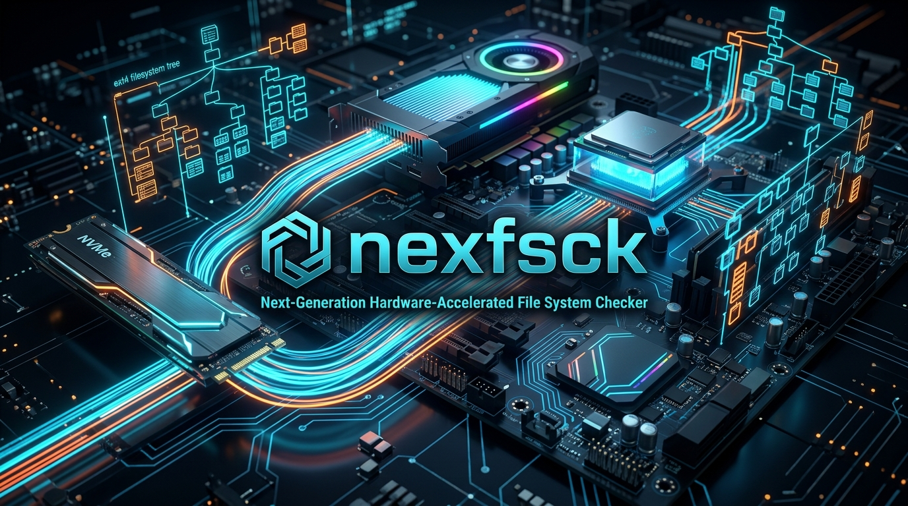
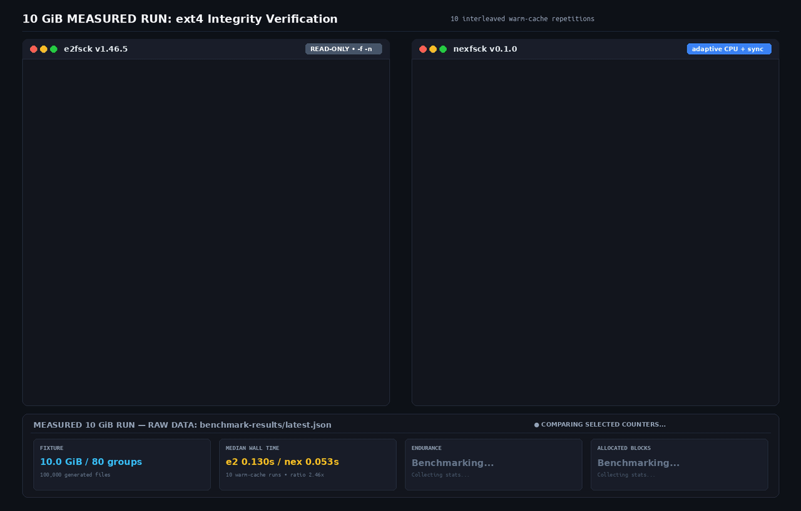

<p align="center">
  
</p>

# `nexfsck` — experimental ext4 checker

[](LICENSE)
[](https://www.rust-lang.org/)

`nexfsck` is an early-stage Linux `ext4` checker written in Rust. It currently combines an optional `io_uring` read path, Rayon parallel verification, and chunked Roaring bitmaps. It is not yet a drop-in replacement for `e2fsck` and should not be used to repair data without a tested backup.

## Current implementation

| Area | Current state |
| --- | --- |
| I/O | Adaptive selection uses synchronous reads for regular image files and `io_uring` for block devices. Explicit `--io-backend sync|uring` overrides are available. The `io_uring` path uses queue depth 128 and persistent registered buffers when permitted. |
| Compute | Rayon parallel inode/extent validation. ext4 CRC32c uses runtime-dispatched x86 SSE4.2 or ARMv8 CRC instructions with a scalar Castagnoli fallback and equivalence tests. AVX-512-specific validation kernels are not used. |
| GPU | The optional `--compute-backend cuda` path dispatches extent intervals through a dynamically loaded CUDA Driver PTX kernel, then revalidates candidates on CPU. Calibration found no end-to-end CUDA crossover through 10 million intervals on the measured RTX 4060 system, so adaptive mode currently selects CPU and avoids CUDA initialization. |
| Parsing | `zerocopy` POD views avoid copies for supported on-disk structures. This does not make the complete I/O-to-validation pipeline zero-copy. |
| Directories | Directory-entry, connectivity, and link-count checks plus indexed H-Tree root/node validation: depth, count/limit, ordered hashes, child bounds, duplicate references, and leaf structure. Directory index rebalancing is not performed. |
| Journal | Fail-closed descriptor/tag/commit/revoke parsing into a bounded replay plan, including 64-bit block tags and checksum-v3 data verification. Only committed, non-revoked writes enter the plan. The library application path durably records each pre-image before writing and is interruption-tested; CLI application remains disabled pending broader real-image fixtures. |
| Repair safety | Versioned, checksummed pre-mutation block images are synced before mutation. Rollback validates complete records and syncs every restored block; replay is idempotent and can restart after interruption. This is not filesystem-level transactional atomicity. |
| UI/metrics | Summary output includes a block-group heatmap, measured scan throughput, and IOPS. `--metrics-listen HOST:PORT` exposes live Prometheus text metrics at `/metrics` while a check runs. |
| 64-bit tracking | Address spaces requiring at most 64 MiB of bitmap storage use a dense `u64` bitset and word-at-a-time reconciliation. Larger spaces fall back to `HashMap<u32, RoaringBitmap>` chunks, preserving 64-bit addresses without unbounded dense allocation. |

The GPU probe and CPU feature detection must not be interpreted as evidence that those devices or instruction sets participated in a check. Runtime output labels them explicitly as detected capabilities only.

## Benchmark policy

Published benchmark results must be reproducible from a committed source revision. The result artifact records that source commit separately from the later commit that publishes the artifact; it also retains every timed sample, median, p95, standard deviation, fixture parameters, tool versions, and cache policy. External process wall time is the headline timing; internal phase timings are diagnostic only.

Comparisons must use the same fixture and cache policy, report the exact commands and environment, and identify whether storage is tmpfs or physical media. Sparse logical image size must not be described as bytes physically read. A benchmark may report aggregate counter parity, but that is not allocation-set, diagnostic, repair, or byte-for-byte parity. GPU or SIMD execution may only be claimed when the run records that the relevant backend actually executed. Do not omit startup, failed runs, or slower backend cases from a comparison. See [`docs/benchmarking.md`](docs/benchmarking.md) and the archived [raw benchmark result](benchmark-results/latest.json).

Historical claims that lack fixture, source, and execution-path provenance—including the old 1 GiB `14x`/RTX 4060/“100% bit-exact” result—are not current project results. The current 10 GiB video is a demonstration, not a substitute for the machine-readable measurements and their stated limitations below.

### Benchmark video

<p align="center">
  <a href="assets/benchmark_live.mp4">
    
  </a>
</p>

Click the preview to open the [MP4 video](assets/benchmark_live.mp4). Full measurements, raw logs, and exact source provenance are in [`benchmark-results/latest.json`](benchmark-results/latest.json); the reproducible runner is [`scripts/stress_benchmark.py`](scripts/stress_benchmark.py). These tmpfs warm-cache results are environment-specific, not bit-exact parity or production-storage performance.

### Integrity coverage

The metadata integrity coverage and ext4 feature compatibility matrix are in [`docs/ext4-integrity-coverage.md`](docs/ext4-integrity-coverage.md). External xattr blocks receive structural, checksum, semantic-hash, and observed cross-inode reference-count checks; extent data is checked against the metadata classes currently mapped by the checker. JBD2 transaction descriptor/commit/revoke traversal and complete metadata ownership coverage remain incomplete, so this is not a claim of full ext4 integrity parity. Nexfsck rejects MMP filesystems. `scripts/differential_ext4.py` exercises real external-xattr corruption fixtures and a checked-in regression manifest, while still listing unimplemented cases. Unsupported feature combinations fail closed. Earlier inode/extent workload measurements in [`docs/hot-path-optimization.md`](docs/hot-path-optimization.md) are historical; refreshed inode-, extent-, directory-, and xattr-specific runs remain outstanding.

## Workspace architecture

- [`crates/nexfsck-core`](crates/nexfsck-core): ext4 on-disk structures and POD parsing.
- [`crates/nexfsck-io`](crates/nexfsck-io): block-device access, `io_uring` batching, fallback reads, and cache controls.
- [`crates/nexfsck-compute`](crates/nexfsck-compute): Rayon validation and hierarchical block tracking.
- [`crates/nexfsck-gpu`](crates/nexfsck-gpu): dynamically loaded CUDA PTX collision candidates with deterministic CPU validation.
- [`crates/nexfsck-journal`](crates/nexfsck-journal): JBD2 inspection and pre-image undo logging.
- [`crates/nexfsck-tui`](crates/nexfsck-tui): text progress and summary output.
- [`crates/nexfsck-cli`](crates/nexfsck-cli): command-line application and fsck-style exit codes.

## Build and test

Requirements: Rust 1.85+ and Linux 5.10+.

```bash
cargo build --release --workspace
cargo test --workspace
```

The root workspace declares the `io-uring` dependency used by `nexfsck-io`, so `cargo check --workspace` resolves all workspace dependencies.

The repository does **not** claim an arbitrary edge-case count. The exact test-to-behavior map is maintained in [`docs/test-coverage.md`](docs/test-coverage.md).

## Usage

Read-only verification is the default:

```bash
./target/release/nexfsck -n filesystem.img
```

Repair writes pre-mutation block images to the selected undo file:

```bash
./target/release/nexfsck --repair --undo-file rollback.undo filesystem.img
./target/release/nexfsck --rollback --undo-file rollback.undo filesystem.img
```

Keep an independent backup. Undo restoration is not failure-proof or atomic across all restored blocks.

## License

Licensed under the [Apache License 2.0](LICENSE).
